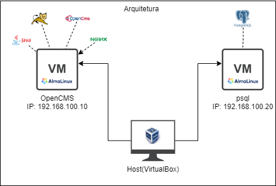
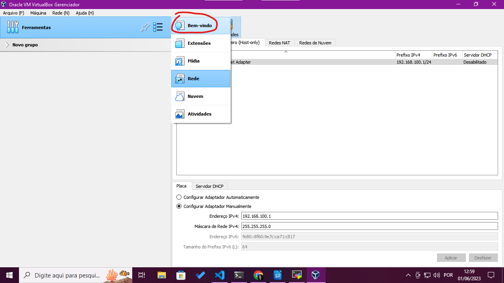

# my-opencms

## Descrição 
Neste projeto foram realizadas algumas implementações do OpenCMS, foram 
utilizadas diversas abordagens desde a manual até algumas mais sofisticadas como
o uso de containers Docker, por exemplo.

>:bulb: Caso queira saber mais sobre o OpenCMS você pode encontrar mais detalhes
[aqui](https://documentation.opencms.org/opencms-documentation/introduction/get-started/)

### Problema
Realizar a implementação do OpenCMS utilizando um banco de dados PostgreSQL
e tendo o Nginx como proxy reverso.

## Implementação

### Implementação manual
Utilizou-se do [Oracle VM Virtualbox](https://www.virtualbox.org/manual/UserManual.html)
para a criação das máquinas virtuais na infraestrutura local.

#### **Design**
Foi criada uma rede virtual e duas VM's conectadas a ela, a primeira possuindo a a instalação do OpenCMS e o próprio Nginx e a outra o banco de dados Postgresql.

**A rede possui as seguintes características:**
|tipo| cidr|
|----|-----------------|
|host-only|192.168.100.0/24|

**As VM's possuem as seguintes características:**
| VM | endereço ip | memória | cpus |
|----|-------------|---------|------|
|opencms|192.168.100.10|2048|1
|psql|192.168.100.20|1024|1

#### Virtualbox
Eu comecei criando a rede que seria responsável por interligar as VM's, 
seguindo os passos a seguir:
1. Acessei o VirtualBox:

2. Naveguei até as definições de rede:

3. Criei a nova rede

4. Alterei o o bloco CIDR padrão dela para o que eu desejava:

Em seguida eu passei para a criação das VM's e a inserção delas na rede:
1. Criei as VMs adicionando as informações presentes na tabela anterior.

2. Adicionei a interface de rede a uma das VM's para que ela pudesse se conectar
a rede, a partir daqui é só repetir o mesmo processo para a segunda VM.

>:bulb: Depois de tudo isso é só realizar a instalação do Almalinux, ela pode ser feita seguindo
o  [guia de instalação do AlmaLinux](https://wiki.almalinux.org/documentation/installation-guide.html#installation) presente na documentação oficial.

#### Linux
Vamos começar definindo os endereços IP's das VM's, o RHEL/AlmaLinux utiliza
um padrão de configuração de rede onde o sistema armazena perfis para os dispositivos
de rede. Os perfis são gerados por uma ferramenta chamada NetworkManager e é
possível altera-los manualmente editando o arquivo de texto dos perfis que se 
encontram no diretório **/etc/NetworkManager/system-connections**, é possível
ver a estrutura de um desses arquivos abaixo:

Apesar de ser possível alterar via texto, nós vamos seguir a boa prática de 
utilizar o **nmcli**, ele é um comando do sistema que nos permite realizar essas 
configurações de rede consequentemente criando ou editando esses arquivos sem 
precisar mexer neles diretamente.

Com isso em mente iniciei as configurações:

1. Listei as conexões de rede disponíveis para identificar a conexão conectada
ao virtualbox.

2. Depois de identificar a Wired Connection, alterei o nome dela para **enp0s8**.

3. Agora com um nome mais simples para identificar a conexão, eu realizei
as modificações a seguir, com os comandos abaixo:

    - Alterei o método de endereçamento para manual
    - Adicionei o endereço IP correspodente
    - Adicionei o gateway(que é o endereço do virtualbox dentro da rede).
    - Adicionei um endereço de servidor dns para resolução de nomes na internet.
    - Reiniciei a interface, desligando ela e ligando novamente(down e up).
    

4. Para facilitar a identificação das máquinas vamos alterar o hostname dela,
para isso vamos utilizar também um utilitário do sistema o **hostnamectl**.
Para isso executei o comando abaixo e reiniciei a sessão do terminal.

5. Repita todos os passos anteriores na VM do psql.

