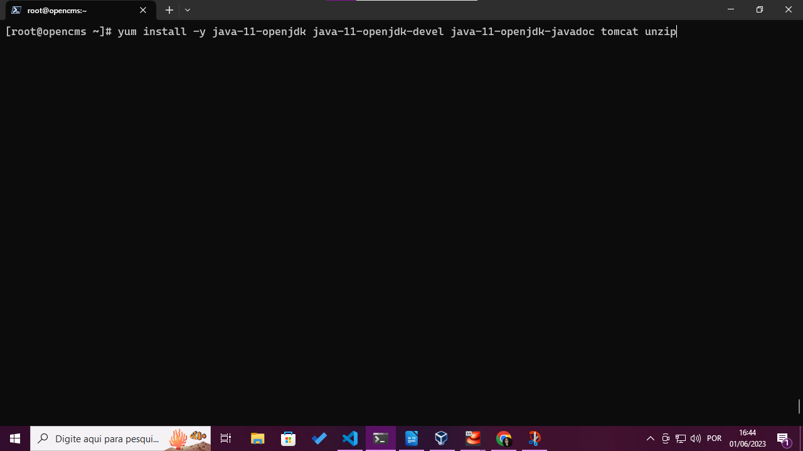
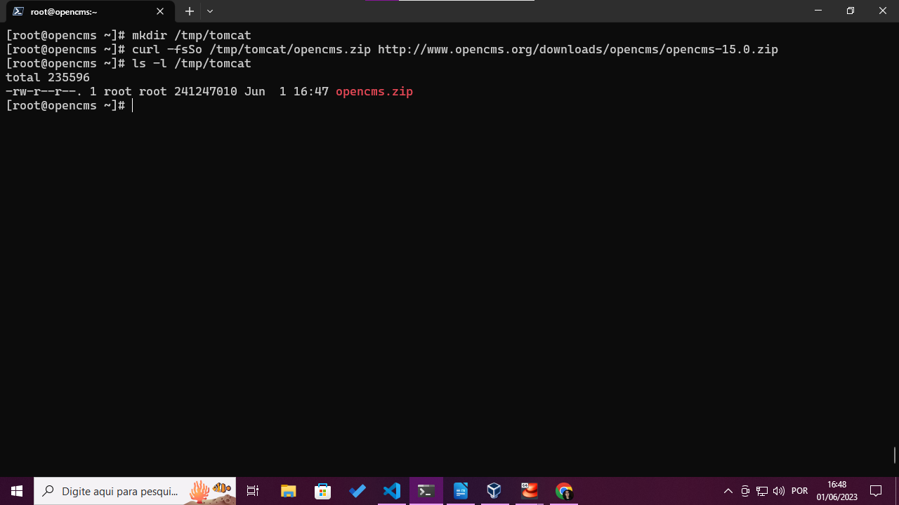
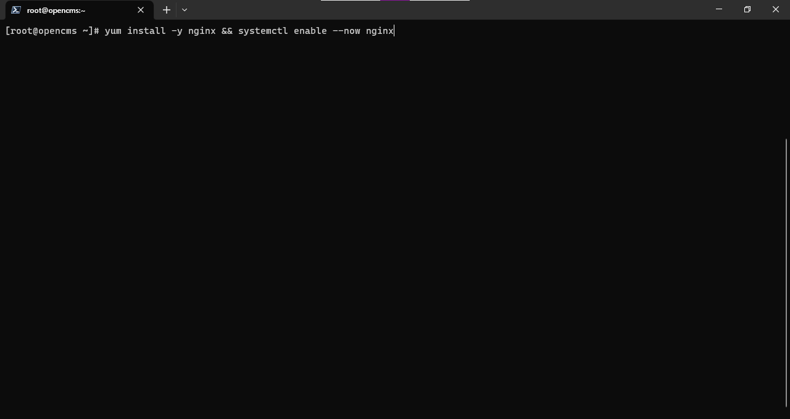
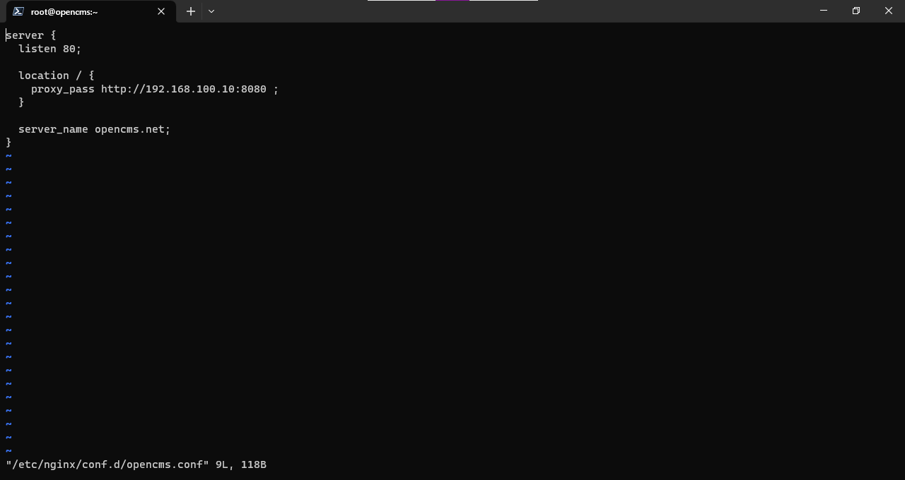

# Indice
- [Descrição do projeto](#descrição-do-projeto)
- [Problema](#problema)
- [Implementação](#implementação)
    - [Implementação manual](#implementação-manual)
        - [Design](#design)
        - [Virtualbox](#virtualbox)
        - [Configurações do sistema](#configurações-do-sistema)
        - [OpenCMS](#opencms)
        - [Nginx](#nginx)
        - [Postgres](#postgres)
        - [Instalação gráfica](#instalação-gráfica)
    - Implementações Automatizadas
        - [Vagrant + Scripts](vagrant/README.md)
        - [Docker](docker/README.md)

## Descrição do projeto
Neste projeto foram realizadas algumas implementações do OpenCMS.

## Problema
Realizar a implementação do OpenCMS utilizando um banco de dados PostgreSQL
e tendo o Nginx como proxy reverso.

## Implementação

### Implementação manual
Utilizei o [Oracle VM Virtualbox](https://www.virtualbox.org/manual/UserManual.html)
para a criação das máquinas virtuais na infraestrutura local.

A instalação do OpenCMS é composta de duas partes, a primeira é a instalação dele 
no servidor fazendo download e instalação dos arquivos juntamente com o banco de dados. 
A segunda parte é feita  graficamente interagindo  com o instalador do OpenCMS 
que fica disponível após a configuração correta dos arquivos no servidor.

#### **Design**
Criei a rede virtual e duas VM's conectadas a ela, a primeira possuindo a instalação do OpenCMS e o próprio Nginx e a outra o banco de dados Postgresql.

**A rede possui as seguintes características:**
|tipo| cidr|
|----|-----------------|
|host-only|192.168.100.0/24|

**As VM's possuem as seguintes características:**
| VM | endereço ip | memória | cpus |
|----|-------------|---------|------|
|opencms|192.168.100.10|2048|1
|psql|192.168.100.20|1024|1

#### Virtualbox
Eu comecei criando a rede que seria responsável por interligar as VM's, 
seguindo os passos a seguir:
1. Acessei o VirtualBox:

2. Naveguei até as definições de rede:

3. Criei a nova rede

4. Alterei o o ip padrão dela para o que eu desejava:

Em seguida eu passei para a criação das VM's e a inserção delas na rede:
1. Criei as VMs adicionando as informações presentes na tabela anterior.

2. Adicionei a interface de rede a uma das VM's para que ela pudesse se conectar
a rede, a partir daqui é só repetir o mesmo processo para a segunda VM.

>:bulb: Depois de tudo foi só realizar a instalação do Almalinux, ela foi feita feita seguindo
o  [guia de instalação do AlmaLinux](https://wiki.almalinux.org/documentation/installation-guide.html#installation) presente na documentação oficial.

#### Configurações do sistema
Comecei definindo os endereços IP's das VM's dentro dos sistemas, 
o RHEL/AlmaLinux utiliza um padrão de configuração de rede onde o sistema 
armazena perfis para os dispositivos de rede. Os perfis são gerados por uma 
ferramenta chamada NetworkManager e é possível altera-los manualmente editando o
arquivo de texto dos perfis que se encontram no diretório **/etc/NetworkManager/system-connections**, é possível ver a estrutura de um desses arquivos abaixo:

Apesar de ser possível alterar via texto, eu optei por seguir a boa prática de 
utilizar o **nmcli**, ele é um comando do sistema que realiza essas configurações
de rede gerenciando esses arquivos para o usuário.

Com isso em mente iniciei as configurações:

1. Listei as conexões de rede disponíveis para identificar a conexão conectada
ao virtualbox.

2. Depois de identificar a Wired Connection, alterei o nome dela para **enp0s8**.

3. Agora com um nome mais simples para identificar a conexão, eu realizei
as modificações a seguir, com os comandos abaixo:

    - Alterei o método de endereçamento para manual
    - Adicionei o endereço IP correspodente
    - Adicionei o gateway(que é o endereço do virtualbox dentro da rede).
    - Adicionei um endereço de servidor dns para resolução de nomes na internet.
    - Reiniciei a interface, desligando ela e ligando novamente(down e up).
    

4. Distribuições baseadas no RHEL possuem alguns recursos de segurança que não 
serão úteis para este ambiente de desenvolvimento, como o SELinux e o Firewalld, 
sendo assim será preciso desabilita-los para que  não bloqueiem o funcionamento 
de nenhuma das nossas ferramentas.

    Para parar o Firewalld faça:

    Para parar o SELinux será preciso deixar o arquivo **/etc/selinux/config** exatamente como este da imagem e
    não esqueça de reiniciar a máquina depois de desativa-lo.

6. Repeti todos os passos acima na VM do psql

#### OpenCMS
Acesse a VM do OpenCMS e siga os comandos abaixo:

1. Instale o Java, tomcat e o unzip

2. Agora é preciso fazer o download do OpenCMS para isso eu criei um diretório
temporário para armazena-lo em **/tmp/tomcat**, depois é preciso fazer o download
dele utilizando o **curl**.

3. O OpenCMs é disponibilizado em um arquivo zipado é preciso extraí-lo utilizando 
o **unzip** que foi instalado anteriormente. 
Após extrai-lo será obtido um arquivo com a extensão .war, esse é de fato a 
aplicação do OpenCMS e ele deve ter sua propriedade alterada para pertencer
ao usuário do Tomcat, isso pode ser feito com o comando **chown** e depois disso
ele deve ser movido para dentro do diretório de aplicações do Tomcat com o comando **mv**, este diretório no caso do Almalinux é em **/var/lib/tomcat/webapps**.

5. Vamos reiniciar o serviço do tomcat e habilita-lo na inicialização do sistema.

#### NGINX
Para as configurações do NGINX, segui os passos a seguir:

1. Instalei o NGINX e Habilitei seu serviço

2. Para configurar as rotas eu criei um arquivo chamado **opencms.conf** no diretório **/etc/nginx/conf.d** e o deixei dessa maneira:

3. Alterei o hostname para opencms.net para bater com o servername definido na 
rota do nginx.

4. Depois de salvar o arquivo é só reiniciar o serviço do NGINX.

#### Postgres

Preparei o psql seguindo os passos abaixo:

1. Instalei o pacote dele

2. Inicializei o banco

3. Habilitei o serviço do postgresql

4. Entrei com o usuário postgres e acessei o banco de dados
pelo utilitário psql.

5. Criei o banco de dados, o usuário dele e dei as permissões necessárias

6. Ainda como o usuário postgres alterei o arquivo de configuração 
**/var/lib/pgsql/data/postgresql.conf** para permitir que o banco escute conexões
externas, para isto precisei adicionar esta linha no final do arquivo.

7. Ainda como o usuário postgres alterei o arquivo de configuração 
**/var/lib/pgsql/data/pg_hba.conf** para permitir que aceite conexões vindas da 
máquina do OpenCMS, para isto precisei adicionar esta linha ao final do arquivo.

8. Depois de salvar o arquivo podemos deslogar do usuário postgres e reiniciar o
serviço do banco.

#### Instalação gráfica
Depois de realizado tudo isso basta acessar o IP da instalação do OpenCMS
através de um navegador, aceitar seus termos de licença e preencher os campos 
com as informações de conexão com o banco de dados e aguardar a instalação finalizar.

