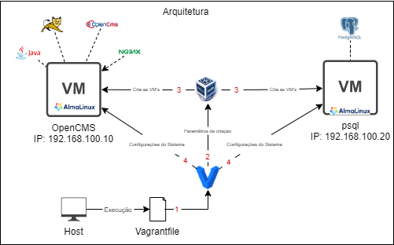

# Indice
- [Descrição](#descrição)
- [Vagrant](#vagrant)
    - [Vagrantfile](#vagrantfile)
        - [Bloco: Vagrant Configure](#bloco-vagrantconfigure)
        - [Diretiva: .vm.box](#diretiva-vmbox)
        - [Bloco: vm.define](#bloco-vmdefine)
        - [Bloco: provider](#bloco-provider)
        - [Bloco: provision](#bloco-provision)
- [Scripts Bash](#scripts-bash)
    - [disable.sh](#disablesh)
        - [Declaração de Funções](#declaração-de-funções)
        - [Execução](#execução)
    - [opencms.sh](#opencmssh)
        - [Declaração de Funções](#declarac3a7c3a3o-de-func3a7c3b5es-1)
        - [Execução](#execuc3a7c3a3o-1)
    - [psql.sh](#psqlsh)
        - [Declaração de Funções](#declarac3a7c3a3o-de-func3a7c3b5es-2)
        - [Execução](#execuc3a7c3a3o-2)
- [Execução do Projeto](#execução-do-projeto)


## Descrição
A abordagem manual tem três problemas principais:
1. Perdemos tempo com configurações no Virtualbox, com coisas como:
criando as redes, definindo as características das VM's e etc.
2. Perdemos tempo com as configurações iniciais do sistema, com coisas como:
a própria instalação do sistema que utilizamos, configurações de ip, hostname e etc.
3. As instalações e configurações das ferramentas demoram  mais do que deveriam 
pois os comandos manuais precisam ser digitados um a um, o que facilita a 
ocorrência de erros e aumenta a possibilidade de ter retrabalho consertando os mesmos.

O Vagrant é uma solução para isso porque ele é capaz de automatizar a criação da
VM no virtualbox, a instalação do sistema e a entrega de configurações.
Para este projeto optou-se pela utilização do Vagrant junto com Scripts Bash, 
dessa forma o Vagrant automatiza a criação das VMs e executa os scripts que vão
fazer as devidas configurações em suas respectivas máquinas.



## Vagrant
### Vagrantfile
É o arquivo onde descrevemos para o Vagrant como a nossa infraestrutura deve ser criada, e ele é composto por várias blocos e diretivas, vou descrever as mais importantes.

>:bulb: Para ver o código clique [aqui](./Vagrantfile)

#### Bloco: Vagrant.Configure
É dentro do bloco **Vagrant.configure** que se define o objeto que será utilizado
para se especificar as configurações da infraestrutura, normalmente da-se o nome
**config** para ele.

``` Ruby
Vagrant.configure("2") do |config|
# Configurações gerais aqui
end
```
#### Diretiva: .vm.box
É onde é feita a definição da imagem do sistema que será utilizado.

``` Ruby
config.vm.box = "Almalinux/9"
```

#### Bloco: vm.define

Pode se ter um ou mais **define**, neles é definido um nome para cada máquina da infraestrutura e suas respectivas configurações. 

``` Ruby
Vagrant.configure("2") do |config|
    config.vm.box = "Almalinux/9"
    
    config.vm.define "opencms" do |opencms|
        # Configurações especificas do OpenCMS aqui
    end

    config.vm.define "psql" do |psql|
        # Configurações especificas do psql aqui
    end
end
```

#### Bloco: provider
Diz respeito as configurações que devem ser feitas pelo provedor,
ou seja, pelo Virtualbox, são configurações relacionadas a alocação de recursos
como memória e cpu.
```Ruby
config.vm.provider "virtualbox" do |v|
    # Configurações da vm no Virtualbox aqui
end
```

#### Bloco: provision
Diz respeito as configurações que serão feitas pelo provisionador,
o provisionador é aquele responsável por entregar as configurações ao 
sistema operacional, o Vagrant suporta várias ferramentas mas neste caso
eu optei por utilizar Scrits Bash, então é nesse ponto onde eu indico qual Script
cada VM vai utilizar.
```Ruby
config.vm.provision "shell" path: "caminho-do-script-aqui"
```

## Scripts Bash
Todos os Scripts estão divididos em duas partes, a primeira é a declaração
das funções e a segunda é a execução responsável por executar as funções anteriores
e também algum código extra caso necessário.

### disable.sh
Desabilita o firewalld e selinux.

>:bulb: Para ver o código clique [aqui](./disable.sh)

#### Declaração de funções
Foram definidas duas funções a **disable_firewalld** e a **disable_selinux**
que serão detalhadas abaixo:

- disable_firewalld: Para e desabilita da inicialização o serviço do firewalld

- disable_selinux: Altera o arquivo de
configuração do SELinux para desativa-lo.

#### Execução


### opencms.sh
Prepara o opencms e o nginx.

>:bulb: Para ver o código clique [aqui](./opencms.sh)

#### Declaração de funções
Aqui foram definidas duas funções, a **config_tomcat** e a **config_nginx**
que serão detalhadas abaixo:

- config_tomcat: Faz o download do opencms e o extrai
para o diretório de aplicações do tomcat corrigindo suas permisões.

- config_nginx: Cria o arquivo de configuração das rotas, 
ele não faz a alteração do arquivo **/etc/hosts** para a criação do hostname
porque o Vagrant faz isso automaticamente na criação da VM.

#### Execução
Faz a instalação de todos os pacotes do java, nginx e tomcat além de executar
as funções anteriores.

### psql.sh
Prepara o postgres.

>:bulb: Para ver o código clique [aqui](./psql.sh)

#### Declaração de funções
Foram definidas essas três funções  **install**, **config**, **run_sql** que serão
definidas abaixo:

- install: Faz a instalação do postgresql, inicializa o arquivos de configuração do banco e habilita o serviço.

- config: Faz as alterações nos arquivos postgresql.conf e ph_hba.conf para permitir que o servidor possa aceitar as conexões vindas do OpenCMS.

- run_sql: Redireciona comandos para o usuário
padrão do banco de dados, o postgres.

#### Execução
Executa as funções install e config e utiliza a função run_sql para executar comandos SQL para criar o banco de dados, o usuário e configurar suas permissões.

## Execução do projeto
Para rodar este projeto e ver o Vagrant criar tudo de forma automatizada, faça
```bash
# O reload é necessário para reiniciar as máquinas depois de desligar o SELINUX
$ vagrant up && vagrant reload
```
Depois é só finalizar a instalação seguindo o instalador gráfico assim como no
projeto de implementação manual.


